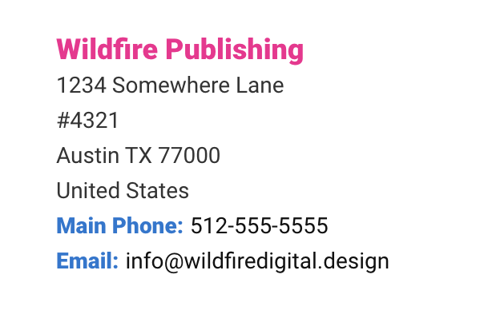

# elr-scss-address

[](https://opensource.org/licenses/MIT)
[](https://npmjs.com/package/elr-scss-address)

a scss mixin for addresses



## Installation

Download node at [nodejs.org](http://nodejs.org) and install it, if you haven't already.

```sh
npm install elr-scss-address --save
```

or

```sh
yarn add elr-scss-address
```

## Implementation

### Arguments

primary-color: primary text color
accent-color: accent text color

### Scss

```scss
@import "elr-scss-address";

.address-block {
  @include elr-address-block(
    $config: (
      color: #111,
      accent-color: #005ebd,
    )
  );
}
```

### HTML

```html
<div class="address-block">
  <address class="address">
    <span class="business-name-line">Wildfire Publishing</span>
    <span class="address-line">1234 Somewhere Lane</span>
    <span class="address-line">#4321</span>
    <span class="address-line">Austin TX 77000</span>
    <span class="address-line">United States</span>
    <span class="contact-line">
      <span class="contact-label">Main Phone:</span> 512-555-5555
    </span>
    <span class="contact-line">
      <span class="contact-label">Email:</span> info@wildfiredigital.design
    </span>
  </address>
</div>
```

## License

SEE LICENSE IN LICENSE.md
